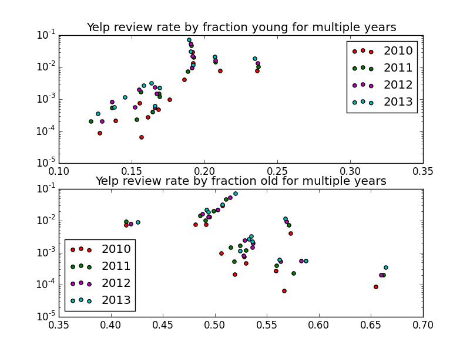

====================================
DDL Incubator 3, Team 7, Censusables
====================================

MVP Analysis
============

Overview
--------
In our MVP, the team attempted to address the following hypothesis:
	There will be a greater number of Yelp reviews in areas with a 
	higher proportion of young people (any aged 18 - 34).
	
After testing, we concluded that there is not a definitive correlation 
between age and Yelp activity when considering demographics based on 
the American Community Survey's (ACS) one year (1Y) survey data.

Next steps include attempting a similar analysis using the ACS five 
year (5Y) survey data and/or exploring other potential relationships.

Analysis Methodology
--------------------

Key Assumptions
~~~~~~~~~~~~~~~
1. Demographics vary too much over time to use 5Y survey data.
2. Quantity of Yelp reviews will increase over time.

Both assumptions were confirmed.  The latter was clear after simple 
data exploration;

for the former, low variability was observed over 
time by calculating the standard deviation of proportional age groups 
divided by the mean.

Process
~~~~~~~
1. Normalize age to fraction of population
2. Calculate number of reviews per county per year

3. Plot and compare response rate by age group (young [18 - 34] and old [35+])
4. Compare response rate per age group by geographic location

Note: Geospatial join process can be reviewed in geojoin.py.

Observations and Conclusions
~~~~~~~~~~~~~~~~~~~~~~~~~~~~
- There is no apparent relationship between age group and response rate during a single year.
- There is no apparent relationship between these two factors when four year mean values are used, though there are a few outstanding values.
- Yelp reviews are concentrated in Hospitality-related businesses (hotels, food, restaurants, etc).
- When reviewed by location, Yelp reviews are primarily focused in a single location, Clark County (Las Vegas).  This is understandable, given the greater proportion of businesses of the type more commonly reviewed on Yelp (see previous comment).

Images:

.. image:: variability.png
